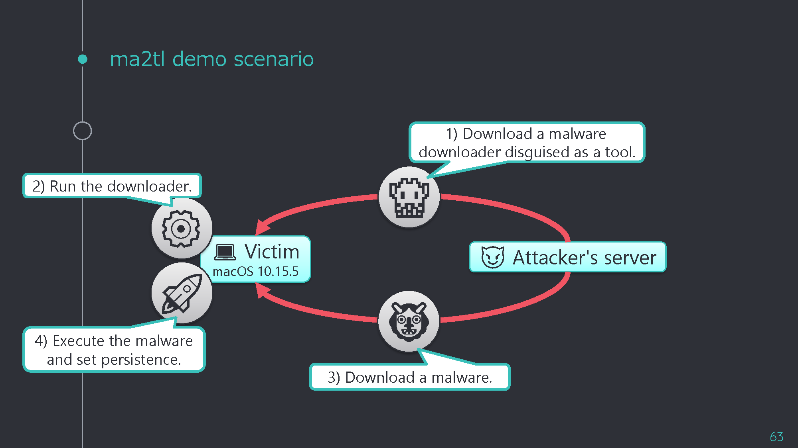
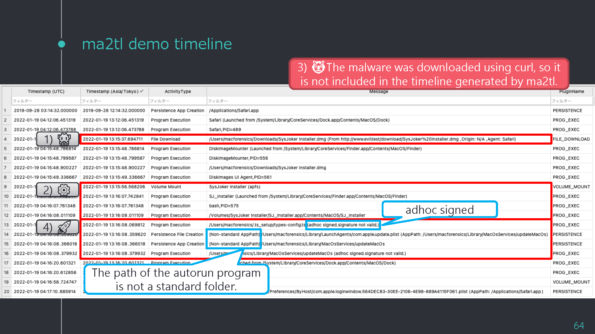

# ma2tl (mac_apt to timeline)

This is a DFIR tool for generating a macOS forensic timeline from the analysis result DBs of [mac_apt](https://github.com/ydkhatri/mac_apt).

## Requirements

- Python 3.7.0 or later
- pytz
- tzlocal
- xlsxwriter

Run pip install -r requirements.txt to install the dependencies.

## Installation

```Shell
% git clone https://github.com/mnrkbys/ma2tl.git
```

## Usage

```Shell
% python ./ma2tl.py -h
usage: ma2tl.py [-h] [-i INPUT] [-o OUTPUT] [-ot OUTPUT_TYPE] [-s START] [-e END] [-t TIMEZONE] [-l LOG_LEVEL] plugin [plugin ...]

Forensic timeline generator using mac_apt analysis results. Supports only SQLite DBs.

positional arguments:
  plugin                Plugins to run (space separated).

optional arguments:
  -h, --help            show this help message and exit
  -i INPUT, --input INPUT
                        Path to a folder that contains mac_apt DBs.
  -o OUTPUT, --output OUTPUT
                        Path to a folder to save ma2tl result.
  -ot OUTPUT_TYPE, --output_type OUTPUT_TYPE
                        Specify the output file type: SQLITE, XLSX, TSV (Default: SQLITE)
  -s START, --start START
                        Specify start timestamp. (ex. 2021-11-05 08:30:00)
  -e END, --end END     Specify end timestamp.
  -t TIMEZONE, --timezone TIMEZONE
                        Specify Timezone: "UTC", "Asia/Tokyo", "US/Eastern", etc (Default: System Local Timezone)
  -l LOG_LEVEL, --log_level LOG_LEVEL
                        Specify log level: INFO, DEBUG, WARNING, ERROR, CRITICAL (Default: INFO)

The following 4 plugins are available:
    FILE_DOWNLOAD       Extract file download activities.
    PERSISTENCE         Extract persistence settings.
    PROG_EXEC           Extract program execution activities.
    VOLUME_MOUNT        Extract volume mount/unmount activities.
    ----------------------------------------------------------------------------
    ALL                 Run all plugins
```

## Generated timeline example




## Presentation

This tool was published on [Japan Security Analyst Conference 2022](https://jsac.jpcert.or.jp/en/index.html) (JSAC2022).

Slides are available below:

- [Japanese version](https://jsac.jpcert.or.jp/archive/2022/pdf/JSAC2022_2_kobayashi_jp.pdf)
- [English version](https://jsac.jpcert.or.jp/archive/2022/pdf/JSAC2022_2_kobayashi_en.pdf)

## Author

[Minoru Kobayashi](https://twitter.com/unkn0wnbit)

## License

[MIT](http://opensource.org/licenses/mit-license.php)
